# Architecture Design
## OSS Compliance Smart Analyzer (OCSA)

| Field | Value |
|---|---|
| Document ID | ADD-OCSA-001 |
| Version | 2.0 |
| Status | Baseline — extended with static and dynamic behavioural views |
| Date | 2026-09-12 |

> **Change log v1.0 → v2.0:** added section 6 (static structure: module dependency graph and
> data-model class diagram) and fully rewrote section 7 (dynamic behaviour) as 13 modelled
> behaviours — 4 sequence diagrams, 6 flowcharts, 3 state machines — each with textual
> analysis. Diagrams use Mermaid, which renders in GitHub, GitLab, VS Code and Obsidian.

---

## 1. Introduction

### 1.1 Purpose

This document describes the internal architecture of OCSA: module decomposition, static
structure, dynamic behaviour, deployment topology and the architectural decisions that shaped
them. It is the reference for anyone maintaining or extending the system.

### 1.2 Scope

Phase 1 as delivered. Phase 2 extensions are noted where they affect current structure.

### 1.3 Reference

Companion documents: requirements (`../02-requirements-analysis/`), conceptual design
(`../03-conceptual-design/`), test report (`../05-testing/`).

---

## 2. Architectural goals and constraints

| ID | Goal | How achieved |
|---|---|---|
| AG-1 | Deterministic, reproducible verdicts | Engine is pure functions; no I/O, no randomness in the verdict path |
| AG-2 | One verdict across all surfaces | UI, CLI and MCP call the same engine functions |
| AG-3 | Zero installation for the reviewer | Static site, no build step for development |
| AG-4 | Supplier data never leaves the machine | No network calls; all analysis client-side |
| AG-5 | Auditable output | Every finding carries rule ID + evidence path |
| AG-6 | Deployable to a CDN | `dist/` is a self-contained static folder |
| AG-7 | Extensible license knowledge | Declarative rule tables in `license-db.js` |
| AG-8 | Survivable without maintenance | Zero runtime dependencies |

| ID | Constraint | Consequence |
|---|---|---|
| AC-1 | No server-side component in Phase 1 | No persistence, no multi-user, no workflow |
| AC-2 | Browser sandbox | No filesystem writes from the UI; exports use Blob download |
| AC-3 | Corporate workstation | Node 18+, no admin rights |
| AC-4 | Engine must be I/O-free | File reading happens in the adapters (CLI/MCP/UI fetch) |

---

## 3. System context

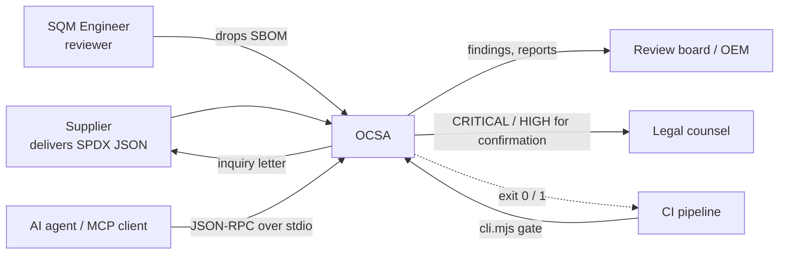
```mermaid
flowchart LR
    Sup["Supplier<br/>delivers SPDX JSON"] --> OCSA
    Rev["SQM Engineer<br/>reviewer"] -->|"drops SBOM"| OCSA
    OCSA -->|"findings, reports"| Board["Review board / OEM"]
    OCSA -->|"inquiry letter"| Sup
    OCSA -->|"CRITICAL / HIGH for confirmation"| Legal["Legal counsel"]
    CI["CI pipeline"] -->|"cli.mjs gate"| OCSA
    Agent["AI agent / MCP client"] -->|"JSON-RPC over stdio"| OCSA
    OCSA -.->|"exit 0 / 1"| CI
```

External actors: supplier (input), reviewer (operator), review board / OEM (consumer), legal
(authority), CI pipeline (automated gate), AI agent (MCP consumer).

---

## 4. Container view

| Container | Technology | Responsibility | Size |
|---|---|---|---|
| Web dashboard | HTML + CSS + ES modules in browser | Interactive analysis and visualisation | `index.html` 141 LOC, `styles.css` 160 LOC, `app.js` 397 LOC, `graph.js` 244 LOC |
| CLI | Node.js | Batch analysis, report generation, CI gate | `cli.mjs` 144 LOC |
| MCP server | Node.js, JSON-RPC over stdio | Agent/LLM interface | `mcp-server.mjs` 321 LOC |
| Domain engine | ES modules, pure | All analysis logic | `spdx.js` 208, `license-db.js` 397, `risk-engine.js` 371, `diff.js` 97, `report.js` 268 = 1 341 LOC |
| Test suite | Node (+ jsdom, dev-only) | 58 assertions | `smoke-test.mjs` 90, `ui-smoke-test.mjs` 117 |
| Static build | Node | Produce deployable `dist/` | `build-static.mjs` 38 LOC |

Total: 1 982 LOC in `src/`, 710 LOC in `tools/` + `scripts/`, 301 LOC of markup and CSS.

---

## 5. Component view

### 5.1 `src/spdx.js` — ingestion

| Aspect | Detail |
|---|---|
| Responsibility | Parse SPDX 2.x JSON into a normalised model; build the dependency graph; assess SBOM completeness |
| Depends on | nothing |
| Key exports | `parseSpdx(json)`, `buildDependencyGraph(sbom)`, `checkSbomQuality(sbom)` |

`parseSpdx` normalises each package to a flat record (SPDXID, name, version, supplier,
downloadLocation, copyrightText, checksums, purl, externalRefs, licenseConcluded,
licenseDeclared, licenseInfoFromFiles, filesAnalyzed). Non-package elements
(`SPDXRef-Document-`, `SPDXRef-File-`) are filtered out. Roots come from `documentDescribes`,
falling back to nodes without an incoming dependency edge.

`buildDependencyGraph` converts relationships to directed edges, classifying each by linkage:

| SPDX relationship | linkage | dev | optional |
|---|---|---|---|
| `STATIC_LINK` | static | no | no |
| `DYNAMIC_LINK` | dynamic | no | no |
| `DEPENDS_ON`, `CONTAINS`, `HAS_PREREQUISITE` | unknown | no | no |
| `DEV_DEPENDENCY_OF`, `BUILD_DEPENDENCY_OF`, `TEST_DEPENDENCY_OF` | unknown | yes | no |
| `OPTIONAL_DEPENDENCY_OF`, `PROVIDED_DEPENDENCY_OF` | unknown | no | yes |

Duplicate edges between the same pair are collapsed, preferring an explicit
`STATIC_LINK`/`DYNAMIC_LINK` over a bare `DEPENDS_ON`.

`checkSbomQuality` runs 12 checks: NTIA-1…7 (supplier, name, version, purl, relationships,
author, timestamp) and AUD-1…5 (checksums, download location, copyright, filesAnalysed,
declared linkage). Returns `{ checks, passed, total, score }`.

### 5.2 `src/license-db.js` — license knowledge

| Aspect | Detail |
|---|---|
| Responsibility | License classification, obligation catalogue, expression parsing, compatibility |
| Depends on | nothing |
| Key exports | `TIERS`, `OBLIGATIONS`, `LICENSE_RULES`, `classifyLicense`, `applyException`, `inspectLicenseText`, `parseExpression`, `evaluateExpression`, `checkCompatibility` |

Rule tables are declarative, matched longest-prefix and case-insensitively:

```js
{ match: 'lgpl-2.', tier: 'HIGH', cat: 'weak-copyleft',
  obl: ['notice','state-changes','source-modified','relinking'], note: '…' }
```

`match: 'lgpl-2.'` covers `LGPL-2.0-only`, `LGPL-2.1-or-later`, `LGPL-2.1+`.

**Tier ranks** are deliberately non-contiguous so that tier lookup by rank is unambiguous:

| Tier | Rank |
|---|---|
| LOW | 1 |
| MEDIUM | 2 |
| HIGH | 3 |
| UNKNOWN | 3.5 |
| CRITICAL | 5 |

> UNKNOWN outranks HIGH so `GPL-2.0 AND NOASSERTION` resolves to CRITICAL rather than masking
> the copyleft. Ranks must remain unique — see BUG-01 in the test report.

**Expression grammar** (recursive descent):

```
expr   := term (OR term)*
term   := factor (AND factor)*
factor := '(' expr ')' | id ('+' | WITH id)?
```

Evaluation: `AND` → worst case (max rank); `OR` → best case (min rank) plus a LIC-007 election
note; `WITH` → consult `LINKING_EXCEPTIONS` and relax along the ladder
`['LOW','MEDIUM','HIGH','CRITICAL']` (UNKNOWN excluded — see BUG-02).

The classification cache maps lowercased id → classification *including* the computed rank
(see BUG-03).

### 5.3 `src/risk-engine.js` — analysis

| Aspect | Detail |
|---|---|
| Responsibility | Effective-license resolution, copyleft propagation, conflicts, findings, scoring |
| Depends on | `license-db.js`, `spdx.js` |
| Key export | `analyze(sbom)` |

Pipeline: resolve → evaluate → propagate → conflicts → aggregate → score.

Propagation severity:

| Copyleft | Linkage | Severity |
|---|---|---|
| strong | static / unknown | CRITICAL |
| strong | dynamic | HIGH |
| weak | static / unknown | MEDIUM (→ LIC-009) |

Every ancestor is marked tainted; findings are emitted only when the target is a distributed
unit root (see BUG-06).

Scoring:

```
density        = min(1, (critical·1.0 + high·0.45 + unknown·0.7 + tainted·0.8) / n)
blockerDensity = min(1, (countCRITICAL + countHIGH·0.4) / max(4, n·0.25))
qualityPenalty = (100 − qualityScore) / 100
score          = round(100 · (0.5·density + 0.3·blockerDensity + 0.2·qualityPenalty))
band           = ≥70 CRITICAL │ ≥45 HIGH │ ≥20 MEDIUM │ else LOW
```

**Finding structure** — `{ id, rule, severity, title, component, componentId, detail,
obligation, action }`.

### 5.4 `src/diff.js` — milestone comparison

| Aspect | Detail |
|---|---|
| Responsibility | Compare two analysed SBOMs |
| Depends on | `license-db.js` (for `TIERS`) |
| Key exports | `identityKey`, `diffSboms`, `diffVerdict` |

`identityKey(c)` = purl with the version stripped (`pkg:generic/qt@6.5.3` → `pkg:generic/qt`),
else `name:<lowercased name>`. This is what prevents a version bump from appearing as
remove + add. Findings are matched on `rule | component | title` so re-generated SPDXIDs
between releases do not create phantom churn.

### 5.5 `src/report.js` — artefact generation

All renderers are pure string builders — no I/O, so the same functions serve CLI file output
and MCP tool results. Exports: `groupByObligation`, `renderComplianceReport`,
`renderNoticeFile`, `renderSupplierInquiry`, `renderComponentsCsv`, `renderDiffReport`.

### 5.6 `src/graph.js` — visualisation

Hand-written force layout on SVG: O(n²) repulsion + spring attraction + weak centring,
integrating on `requestAnimationFrame`. The loop stops when motion falls below a threshold
(BUG-12) and restarts on interaction. Nodes above 600 are down-sampled by
`rank·10 + degree + root bonus + taint bonus`, with the hidden count surfaced.

### 5.7 `src/app.js` — presentation wiring

No exports; runs on load. Owns UI state (`{ sbom, result, graph, selected, previous,
previousName }`), renders all views, handles filtering, the detail panel, and JSON/CSV export.

### 5.8 Adapters

| Adapter | Notes |
|---|---|
| `tools/cli.mjs` | Six commands. Boolean flags use a dedicated `has()` helper (BUG-07) |
| `tools/mcp-server.mjs` | Hand-written JSON-RPC 2.0, newline-delimited stdio. Implements `initialize`, `tools/list`, `tools/call`, `ping`. Results are cached per SBOM path |
| `scripts/build-static.mjs` | Copies browser-facing files → `dist/` |

---

## 6. Static structure

### 6.1 Notation rationale

Different structural and behavioural concerns need different notations. The choice per
behaviour is deliberate:

| Behaviour | Notation | Why |
|---|---|---|
| Module decomposition | Dependency graph (flowchart) | Shows allowed import direction and layering violations |
| Data model | Class diagram | Shows entities, attributes and cardinality |
| Request/response over time | Sequence diagram | Shows who calls whom, in what order, and what is returned |
| Algorithms with branches | Flowchart | Shows decision points and termination conditions |
| Entities with discrete modes | State machine | Shows legal transitions and guards |
| Deployment | Node graph | Shows where code executes |

### 6.2 Module dependency graph

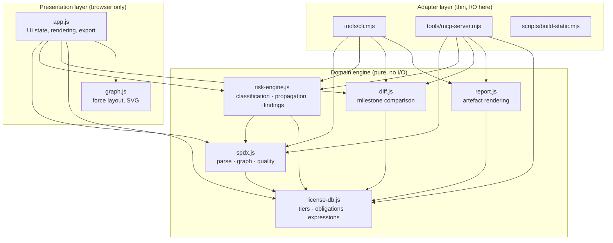
```mermaid
flowchart TD
    subgraph presentation["Presentation layer (browser only)"]
        APP["app.js<br/>UI state, rendering, export"]
        GRAPH["graph.js<br/>force layout, SVG"]
    end

    subgraph adapters["Adapter layer (thin, I/O here)"]
        CLI["tools/cli.mjs"]
        MCP["tools/mcp-server.mjs"]
        BUILD["scripts/build-static.mjs"]
    end

    subgraph engine["Domain engine (pure, no I/O)"]
        SPDX["spdx.js<br/>parse · graph · quality"]
        LDB["license-db.js<br/>tiers · obligations · expressions"]
        RISK["risk-engine.js<br/>classification · propagation · findings"]
        DIFF["diff.js<br/>milestone comparison"]
        REP["report.js<br/>artefact rendering"]
    end

    APP --> SPDX
    APP --> RISK
    APP --> DIFF
    APP --> LDB
    APP --> GRAPH
    CLI --> SPDX
    CLI --> RISK
    CLI --> DIFF
    CLI --> REP
    MCP --> SPDX
    MCP --> RISK
    MCP --> DIFF
    MCP --> REP
    MCP --> LDB
    RISK --> SPDX
    RISK --> LDB
    DIFF --> LDB
    REP --> LDB
    SPDX --> LDB
```

**Analysis.** The graph is a strict DAG with three tiers and no cycles. Two properties matter:

1. **`license-db.js` is a sink.** It imports nothing. It is the only module holding domain
   policy as data, so a license change touches exactly one file.
2. **All I/O stops at the adapter boundary.** `app.js` performs `fetch` and `FileReader`;
   `cli.mjs` and `mcp-server.mjs` perform `fs` and `stdio`. Nothing in the engine reads a file,
   writes a file, or touches the network.

That second property is what guarantees AG-2: the browser, the CLI and the MCP server cannot
disagree, because they execute literally the same functions on the same input. It also makes
the engine testable without fixtures beyond a JSON object — which is why the engine suite needs
no jsdom.

`graph.js` is deliberately isolated from the engine: it receives plain `{id,label,color,...}`
nodes and knows nothing about licenses. The visualisation could be replaced without touching
any analysis code.

### 6.3 Data model

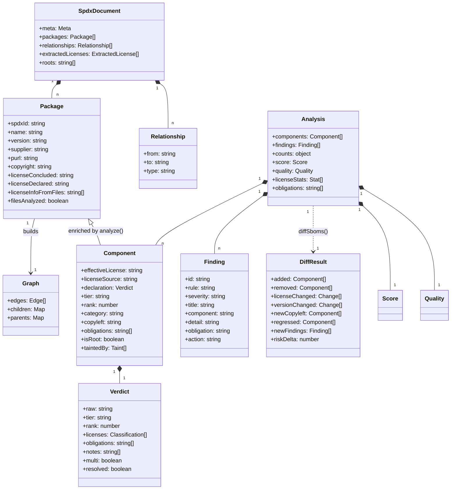
```mermaid
classDiagram
    class SpdxDocument {
        +meta: Meta
        +packages: Package[]
        +relationships: Relationship[]
        +extractedLicenses: ExtractedLicense[]
        +roots: string[]
    }
    class Package {
        +spdxId: string
        +name: string
        +version: string
        +supplier: string
        +purl: string
        +copyright: string
        +licenseConcluded: string
        +licenseDeclared: string
        +licenseInfoFromFiles: string[]
        +filesAnalyzed: boolean
    }
    class Relationship {
        +from: string
        +to: string
        +type: string
    }
    class Graph {
        +edges: Edge[]
        +children: Map
        +parents: Map
    }
    class Component {
        +effectiveLicense: string
        +licenseSource: string
        +declaration: Verdict
        +tier: string
        +rank: number
        +category: string
        +copyleft: string
        +obligations: string[]
        +isRoot: boolean
        +taintedBy: Taint[]
    }
    class Verdict {
        +raw: string
        +tier: string
        +rank: number
        +licenses: Classification[]
        +obligations: string[]
        +notes: string[]
        +multi: boolean
        +resolved: boolean
    }
    class Finding {
        +id: string
        +rule: string
        +severity: string
        +title: string
        +component: string
        +detail: string
        +obligation: string
        +action: string
    }
    class Analysis {
        +components: Component[]
        +findings: Finding[]
        +counts: object
        +score: Score
        +quality: Quality
        +licenseStats: Stat[]
        +obligations: string[]
    }
    class DiffResult {
        +added: Component[]
        +removed: Component[]
        +licenseChanged: Change[]
        +versionChanged: Change[]
        +newCopyleft: Component[]
        +regressed: Component[]
        +newFindings: Finding[]
        +riskDelta: number
    }

    SpdxDocument "1" *-- "n" Package
    SpdxDocument "1" *-- "n" Relationship
    Package "1" --> "1" Graph : builds
    Package <|-- Component : enriched by analyze()
    Component "1" *-- "1" Verdict
    Analysis "1" *-- "n" Component
    Analysis "1" *-- "n" Finding
    Analysis "1" *-- "1" Score
    Analysis "1" *-- "1" Quality
    Analysis "1" ..> "1" DiffResult : diffSboms()
```

**Analysis.** Three observations:

1. **`Component` extends `Package`.** Analysis does not build a parallel object graph; it
   decorates the parsed package with verdict fields. This keeps the original SPDX fields
   (`licenseDeclared`, `licenseConcluded`) available for the detail panel and for audit — a
   reviewer can always see *why* a license was chosen.
2. **`Finding` is immutable and self-contained.** Every field needed to act on a finding is in
   the finding itself. Findings are the unit of export, of diffing, and of waiver (Phase 2).
3. **`Verdict` retains `licenses[]` (every term), not just the resulting tier.** This is what
   lets the UI show "elected LGPL-2.1 out of `LGPL-2.1 OR GPL-2.0`" — the audit trail for
   ADR-007.

---

## 7. Dynamic behaviour

### 7.1 Behaviour inventory

| ID | Behaviour | Notation | Participants |
|---|---|---|---|
| B-01 | Web SBOM analysis | Sequence | Reviewer, app.js, spdx.js, risk-engine.js, graph.js |
| B-02 | CLI release gate | Sequence | CI, cli.mjs, engine |
| B-03 | MCP tool call | Sequence | Agent, mcp-server.mjs, engine |
| B-04 | Milestone diff | Sequence | Caller, diff.js, engine |
| B-05 | Effective license resolution | Flowchart | risk-engine.js |
| B-06 | SPDX expression evaluation | Flowchart | license-db.js |
| B-07 | Copyleft propagation | Flowchart | risk-engine.js |
| B-08 | Compatibility conflict detection | Flowchart | risk-engine.js |
| B-09 | Risk scoring | Flowchart | risk-engine.js |
| B-10 | Release gate decision | Flowchart | cli.mjs |
| B-11 | Component classification lifecycle | State machine | Component |
| B-12 | UI application lifecycle | State machine | app.js |
| B-13 | Graph simulation lifecycle | State machine | graph.js |

---

### B-01 — Web SBOM analysis (sequence)

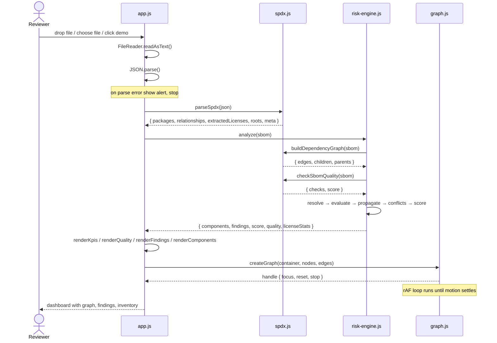
```mermaid
sequenceDiagram
    actor U as Reviewer
    participant UI as app.js
    participant P as spdx.js
    participant E as risk-engine.js
    participant G as graph.js

    U->>UI: drop file / choose file / click demo
    UI->>UI: FileReader.readAsText()
    UI->>UI: JSON.parse()
    Note over UI: on parse error show alert, stop

    UI->>P: parseSpdx(json)
    P-->>UI: { packages, relationships, extractedLicenses, roots, meta }

    UI->>E: analyze(sbom)
    E->>P: buildDependencyGraph(sbom)
    P-->>E: { edges, children, parents }
    E->>P: checkSbomQuality(sbom)
    P-->>E: { checks, score }
    E->>E: resolve → evaluate → propagate → conflicts → score
    E-->>UI: { components, findings, score, quality, licenseStats }

    UI->>UI: renderKpis / renderQuality / renderFindings / renderComponents
    UI->>G: createGraph(container, nodes, edges)
    G-->>UI: handle { focus, reset, stop }
    Note over G: rAF loop runs until motion settles

    UI-->>U: dashboard with graph, findings, inventory
```

**Analysis.** Four characteristics are worth calling out.

**Everything is synchronous after the file read.** There is no server round-trip, so there is
no loading state, no retry logic, and no failure mode beyond a parse error. For a 42-component
SBOM the whole pipeline completes in well under a second; the only asynchronous part is the
graph's animation loop, which is purely visual and cannot produce a wrong verdict.

**Parse errors terminate early and loudly.** A non-SPDX JSON is rejected at `parseSpdx` with a
targeted message ("No packages array found. Is this an SPDX JSON file?") rather than producing
an empty dashboard that looks like a clean result. A silently empty result would be the worst
possible failure for a compliance tool.

**The engine is called exactly once.** `analyze` returns everything the UI needs — components,
findings, score, quality, statistics. Re-rendering a filtered view never re-runs analysis, so
filtering is instant and cannot change a verdict.

**The graph is constructed last and cannot block the verdict.** If `createGraph` were to fail,
the findings and inventory are already on screen. Visualisation is never on the critical path
to an answer.

---

### B-02 — CLI release gate (sequence)

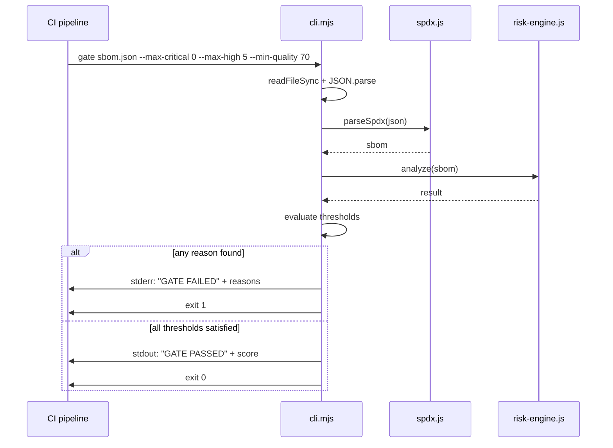
```mermaid
sequenceDiagram
    participant CI as CI pipeline
    participant C as cli.mjs
    participant P as spdx.js
    participant E as risk-engine.js

    CI->>C: gate sbom.json --max-critical 0 --max-high 5 --min-quality 70
    C->>C: readFileSync + JSON.parse
    C->>P: parseSpdx(json)
    P-->>C: sbom
    C->>E: analyze(sbom)
    E-->>C: result

    C->>C: evaluate thresholds
    alt any reason found
        C->>CI: stderr: "GATE FAILED" + reasons
        C->>CI: exit 1
    else all thresholds satisfied
        C->>CI: stdout: "GATE PASSED" + score
        C->>CI: exit 0
    end
```

**Analysis.** The contract is deliberately narrow: **the exit code is the interface**. A CI
system needs nothing else — it does not parse output, does not read a report file, and does not
need to know what a "finding" is. This is why the gate is a separate command rather than a flag
on `analyze`: a separate command can own a clean exit-code contract without ambiguity.

Two details matter operationally:

- **Reasons go to stderr, the success line to stdout.** A pipeline that captures only stdout
  still fails on a non-zero exit, and a human reading the log sees the reasons without them
  being swallowed by a success message.
- **Unresolved licenses always fail the gate unless explicitly waived** with
  `--allow-unresolved`. This is intentional: an unresolved license is not a *risk judgement*,
  it is missing data, and missing data should never pass silently. The flag exists because some
  programmes legitimately accept known-proprietary components, but requiring the operator to
  say so explicitly keeps the default safe.

---

### B-03 — MCP tool call (sequence)

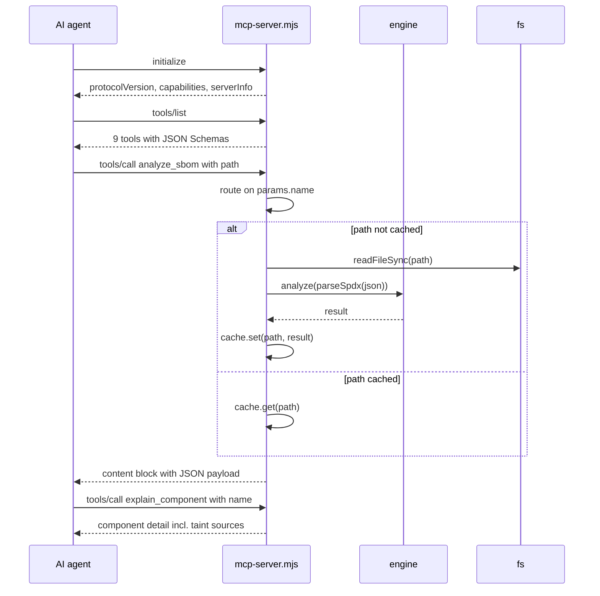
```mermaid
sequenceDiagram
    participant A as AI agent
    participant S as mcp-server.mjs
    participant E as engine
    participant FS as fs

    A->>S: initialize
    S-->>A: protocolVersion, capabilities, serverInfo
    A->>S: tools/list
    S-->>A: 9 tools with JSON Schemas

    A->>S: tools/call analyze_sbom with path
    S->>S: route on params.name
    alt path not cached
        S->>FS: readFileSync(path)
        S->>E: analyze(parseSpdx(json))
        E-->>S: result
        S->>S: cache.set(path, result)
    else path cached
        S->>S: cache.get(path)
    end
    S-->>A: content block with JSON payload

    A->>S: tools/call explain_component with name
    S-->>A: component detail incl. taint sources
```

**Analysis.** Three design points.

**The cache is keyed on the SBOM path, not on the tool.** `explain_component` and
`find_components` reuse the analysis already performed by `analyze_sbom`, so an agent can ask
follow-up questions without re-parsing. Because analysis is deterministic (AG-1), caching is
safe — the same path always yields the same result within a process lifetime.

**The engine decides; the model narrates.** Every tool returns data produced by the
deterministic engine. Nothing in the protocol lets the agent set a tier, a severity, or a
score. This is ADR-014 made structural rather than advisory: the agent *cannot* influence the
verdict even if prompted to.

**Errors are returned, not thrown.** An unknown tool or a bad path yields a JSON-RPC response
with `isError: true` and a readable message. The server never crashes the stdio stream, which
would kill the agent's session — an important property for a long-lived subprocess.

---

### B-04 — Milestone diff (sequence)

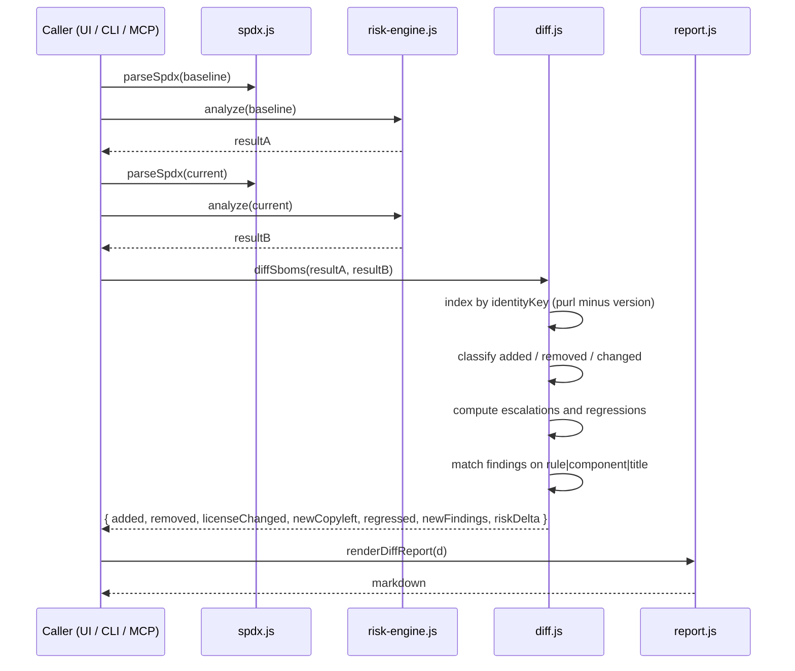
```mermaid
sequenceDiagram
    participant C as Caller (UI / CLI / MCP)
    participant P as spdx.js
    participant E as risk-engine.js
    participant D as diff.js
    participant R as report.js

    C->>P: parseSpdx(baseline)
    C->>E: analyze(baseline)
    E-->>C: resultA
    C->>P: parseSpdx(current)
    C->>E: analyze(current)
    E-->>C: resultB
    C->>D: diffSboms(resultA, resultB)

    D->>D: index by identityKey (purl minus version)
    D->>D: classify added / removed / changed
    D->>D: compute escalations and regressions
    D->>D: match findings on rule|component|title
    D-->>C: { added, removed, licenseChanged, newCopyleft, regressed, newFindings, riskDelta }

    C->>R: renderDiffReport(d)
    R-->>C: markdown
```

**Analysis.** The diff operates on **analysis results, not on raw SBOMs**. This is significant:
it means the diff compares *verdicts*, so a change is reported when the compliance
consequence changes, not merely when a string differs. If a supplier reformats an SPDX
expression without altering its meaning, no diff is produced.

The **identity key** is the load-bearing detail. Matching on purl-without-version means
`qt@6.5.2 → qt@6.5.3` is one version change; matching on name+version would have produced one
removal and one addition, and worse, would have lost the license-change comparison entirely.

**Finding matching** uses `rule | component | title` rather than the finding `id`, because ids
embed SPDXIDs which suppliers regenerate between releases. Without this, every finding would
appear as both new and closed on every release — the diff would be pure noise.

---

### B-05 — Effective license resolution (flowchart)

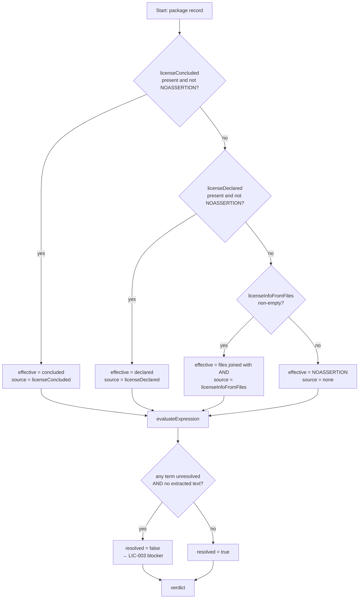
```mermaid
flowchart TD
    A["Start: package record"] --> B{"licenseConcluded<br/>present and not NOASSERTION?"}
    B -->|yes| Z["effective = concluded<br/>source = licenseConcluded"]
    B -->|no| C{"licenseDeclared<br/>present and not NOASSERTION?"}
    C -->|yes| Z2["effective = declared<br/>source = licenseDeclared"]
    C -->|no| D{"licenseInfoFromFiles<br/>non-empty?"}
    D -->|yes| Z3["effective = files joined with AND<br/>source = licenseInfoFromFiles"]
    D -->|no| Z4["effective = NOASSERTION<br/>source = none"]

    Z --> E["evaluateExpression"]
    Z2 --> E
    Z3 --> E
    Z4 --> E
    E --> F{"any term unresolved<br/>AND no extracted text?"}
    F -->|yes| G["resolved = false<br/>→ LIC-003 blocker"]
    F -->|no| H["resolved = true"]
    G --> I["verdict"]
    H --> I
```

**Analysis.** The fallback chain exists because real supplier SBOMs are inconsistent: some
populate only `licenseDeclared`, some only `licenseInfoFromFiles`, and a depressing number
populate `NOASSERTION` everywhere. A tool that demanded `licenseConcluded` would reject most
real input; a tool that ignored the distinction would lose the information about *how*
confident the verdict is.

Recording **which field was used** (`licenseSource`) is what makes the result auditable. A
finding derived from `licenseInfoFromFiles` is weaker evidence than one derived from
`licenseConcluded`, and the detail panel shows which.

The final guard encodes ADR-009: a `LicenseRef-` whose text was supplied in
`hasExtractedLicensingInfos` is *resolved for copyleft purposes*. It remains UNKNOWN tier
(because a human should look at it) but does not raise the LIC-003 blocker — otherwise every
proprietary component in the BOM would produce a HIGH finding and bury the real ones.

---

### B-06 — SPDX expression evaluation (flowchart)

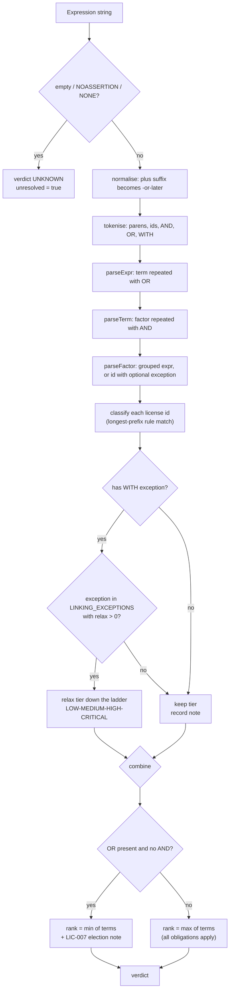
```mermaid
flowchart TD
    A["Expression string"] --> B{"empty / NOASSERTION / NONE?"}
    B -->|yes| C["verdict UNKNOWN<br/>unresolved = true"]
    B -->|no| D["normalise: plus suffix becomes -or-later"]
    D --> E["tokenise: parens, ids, AND, OR, WITH"]
    E --> F["parseExpr: term repeated with OR"]
    F --> G["parseTerm: factor repeated with AND"]
    G --> H["parseFactor: grouped expr, or id with optional exception"]

    H --> I["classify each license id<br/>(longest-prefix rule match)"]
    I --> J{"has WITH exception?"}
    J -->|yes| K{"exception in LINKING_EXCEPTIONS<br/>with relax > 0?"}
    K -->|yes| L["relax tier down the ladder<br/>LOW-MEDIUM-HIGH-CRITICAL"]
    K -->|no| M["keep tier<br/>record note"]
    J -->|no| M

    L --> N{"combine"}
    M --> N
    N --> O{"OR present and no AND?"}
    O -->|yes| P["rank = min of terms<br/>+ LIC-007 election note"]
    O -->|no| Q["rank = max of terms<br/>(all obligations apply)"]
    P --> R["verdict"]
    Q --> R
```

**Analysis.** Two non-obvious decisions are encoded here.

**`AND` takes the worst case, `OR` the best.** This is not a simplification — it reflects what
the operators mean. `A AND B` means both licenses apply simultaneously, so the strongest
obligation governs. `A OR B` grants a choice, so the licensee may elect the more favourable
term. Scoring `OR` as the worst case would systematically over-report dual-licensed
components (Qt, ffmpeg, NSS…), which is precisely the kind of false positive that gets a
compliance tool ignored.

**The relaxation ladder excludes UNKNOWN.** When a GPL license carries a linking exception, the
tier steps down *within the copyleft strength scale* — `CRITICAL → HIGH`. If UNKNOWN were on
the ladder, `CRITICAL` would relax onto `UNKNOWN` and produce a nonsense verdict that looks
like missing data. This was BUG-02 and is the reason the ladder is explicit rather than
"one step down the tier list".

The parser is recursive descent over five token types, which is enough for real SPDX
expressions. It does not validate against the SPDX license list — see TD-09.

---

### B-07 — Copyleft propagation (flowchart)

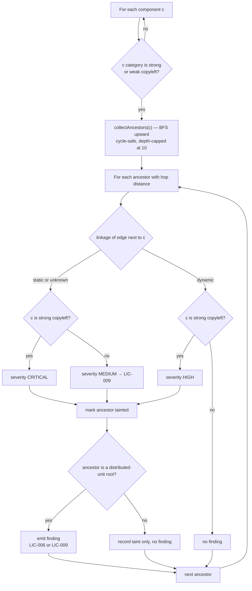
```mermaid
flowchart TD
    A["For each component c"] --> B{"c category is strong<br/>or weak copyleft?"}
    B -->|no| A
    B -->|yes| C["collectAncestors(c) — BFS upward<br/>cycle-safe, depth-capped at 10"]

    C --> D["For each ancestor with hop distance"]
    D --> E{"linkage of edge next to c"}
    E -->|"static or unknown"| F{"c is strong copyleft?"}
    E -->|"dynamic"| G{"c is strong copyleft?"}
    F -->|yes| H["severity CRITICAL"]
    F -->|no| I["severity MEDIUM → LIC-009"]
    G -->|yes| J["severity HIGH"]
    G -->|no| K["no finding"]

    H --> L["mark ancestor tainted"]
    I --> L
    J --> L
    L --> M{"ancestor is a distributed-unit root?"}
    M -->|yes| N["emit finding<br/>LIC-006 or LIC-009"]
    M -->|no| O["record taint only, no finding"]
    N --> P["next ancestor"]
    O --> P
    K --> P
    P --> D
```

**Analysis.** The algorithm walks **upward** from the copyleft component, not downward from the
root. That direction is what makes it efficient: only copyleft components initiate a walk, so
a BOM with 5 % copyleft performs 5 % of the traversals a root-down search would.

**Taint and findings are decoupled.** Every ancestor is marked tainted (so the graph can draw
the red ring and the inventory can show inherited risk), but findings are emitted only at the
distributed-unit root. This directly fixes BUG-06: the first implementation emitted a finding
per hop and produced 22 identical CRITICAL entries for a single AGPL component. No information
is lost — the taint chain is still visible in the detail panel — but the findings list stays
actionable.

**The conservative default lives in the "unknown" branch.** `DEPENDS_ON` carries no linkage
information, and it is treated as static. In automotive firmware this is nearly always correct,
and the alternative (treating it as dynamic) would under-report the most common real violation.
Every finding raised on this path states "linkage not declared" so the supplier can correct it
and the finding disappears. Over-reporting with a visible, correctable reason is the right
trade for a compliance gate.

**Cycle safety** is not theoretical: hand-maintained SBOMs regularly contain
`A DEPENDS_ON B` and `B DEPENDS_ON A`. The BFS tracks best-known hop distance per node and
refuses to revisit, so the walk terminates.

---

### B-08 — Compatibility conflict detection (flowchart)

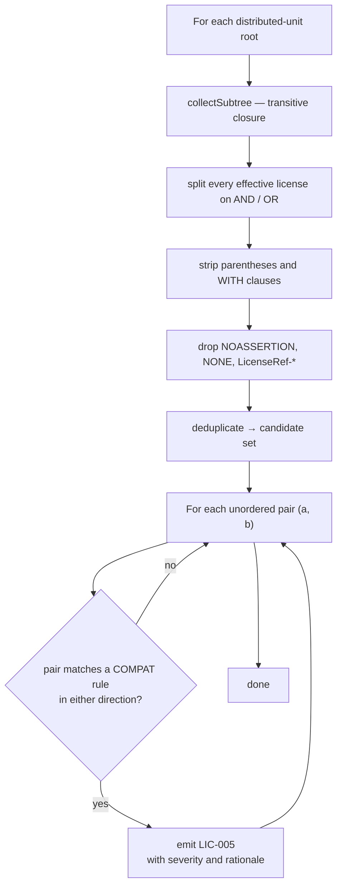
```mermaid
flowchart TD
    A["For each distributed-unit root"] --> B["collectSubtree — transitive closure"]
    B --> C["split every effective license on AND / OR"]
    C --> D["strip parentheses and WITH clauses"]
    D --> E["drop NOASSERTION, NONE, LicenseRef-*"]
    E --> F["deduplicate → candidate set"]

    F --> G["For each unordered pair (a, b)"]
    G --> H{"pair matches a COMPAT rule<br/>in either direction?"}
    H -->|no| G
    H -->|yes| I["emit LIC-005<br/>with severity and rationale"]
    I --> G
    G --> J["done"]
```

**Analysis.** The candidate set is deliberately filtered before comparison. `NOASSERTION` and
`LicenseRef-*` are dropped because there is nothing to compare against — flagging them would
duplicate LIC-003 and LIC-004 rather than add information.

The rule table is coarse: it matches on license *family prefixes* (`gpl-2.0`, `epl-`, `cddl-`)
rather than exact identifiers, because the well-known incompatibilities (GPL-2.0 + Apache-2.0,
EPL + GPL, CDDL + GPL) are family-level properties. Each rule carries a rationale string that
is surfaced verbatim in the finding, so a reviewer sees *why* two licenses conflict rather than
just that they do.

The known weakness is granularity: the closure is computed over the whole subtree of a root,
so two components in **separate executables** that happen to share a root would be reported as
conflicting even though they never combine. This is RR-03 and P2-06 — resolving it needs a
process/executable boundary map from the supplier. Until then the behaviour is conservative and
documented.

---

### B-09 — Risk scoring (flowchart)

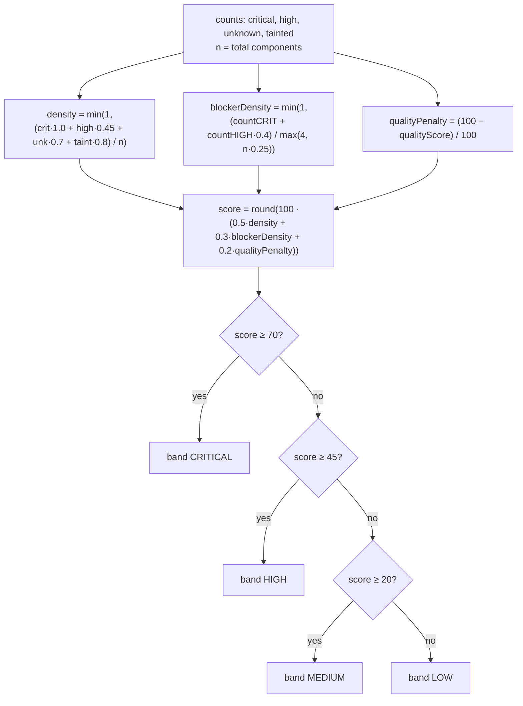
```mermaid
flowchart TD
    A["counts: critical, high, unknown, tainted<br/>n = total components"] --> B["density = min(1,<br/>(crit·1.0 + high·0.45 + unk·0.7 + taint·0.8) / n)"]
    A --> C["blockerDensity = min(1,<br/>(countCRIT + countHIGH·0.4) / max(4, n·0.25))"]
    A --> D["qualityPenalty = (100 − qualityScore) / 100"]

    B --> E["score = round(100 ·<br/>(0.5·density + 0.3·blockerDensity + 0.2·qualityPenalty))"]
    C --> E
    D --> E

    E --> F{"score ≥ 70?"}
    F -->|yes| G["band CRITICAL"]
    F -->|no| H{"score ≥ 45?"}
    H -->|yes| I["band HIGH"]
    H -->|no| J{"score ≥ 20?"}
    J -->|yes| K["band MEDIUM"]
    J -->|no| L["band LOW"]
```

**Analysis.** The formula is the second attempt. The first (BUG-08) was a weighted sum of
finding counts multiplied by a constant, which saturated at 100 on the very first realistic
SBOM — a score that cannot move is worse than no score, because it looks informative.

**Density is the corrective.** Dividing by component count makes the score comparable across
ECUs of different sizes and across milestones of the same ECU. A 200-component BOM with 10
critical components is a smaller problem than a 40-component BOM with the same 10, and
density expresses that.

The three weights encode a priority order: **what is in the BOM (0.5) matters more than how
many findings it produced (0.3), which matters more than how well documented it is (0.2).**
Documentation quality is included because an SBOM that cannot be trusted should not score well,
but it is deliberately the smallest term — a beautifully documented GPL violation is still a
GPL violation.

Two honest caveats: the weights are **judgement, not calibration** — they have not been fitted
against historical outcomes, and the test suite only asserts the score is in range (see the
coverage gap in the test report). The score should be read as a trend indicator between
milestones, not as an absolute measure.

---

### B-10 — Release gate decision (flowchart)

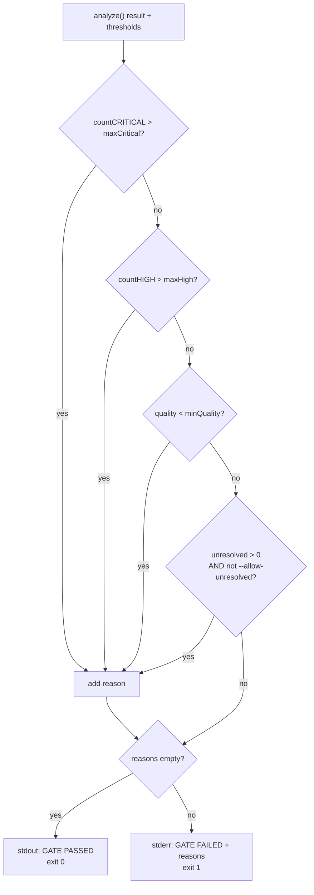
```mermaid
flowchart TD
    A["analyze() result + thresholds"] --> B{"countCRITICAL > maxCritical?"}
    B -->|yes| R["add reason"]
    B -->|no| C{"countHIGH > maxHigh?"}
    C -->|yes| R
    C -->|no| D{"quality < minQuality?"}
    D -->|yes| R
    D -->|no| E{"unresolved > 0<br/>AND not --allow-unresolved?"}
    E -->|yes| R
    E -->|no| F{"reasons empty?"}

    R --> F
    F -->|yes| G["stdout: GATE PASSED<br/>exit 0"]
    F -->|no| H["stderr: GATE FAILED + reasons<br/>exit 1"]
```

**Analysis.** All four checks are evaluated before any decision is taken — the gate collects
*all* reasons rather than short-circuiting on the first. An engineer reading a CI log gets the
complete list of what must be fixed, not one item per run.

The checks are ordered by severity but are logically independent. Defaults are
`--max-critical 0`, `--max-high 0`, `--min-quality 0`, which is the strictest sensible posture:
out of the box the gate blocks on any critical or high finding. A programme that wants a
looser posture must state it explicitly in the pipeline command, and that statement is visible
in version control — which is exactly where a compliance policy should be recorded.

---

### B-11 — Component classification lifecycle (state machine)

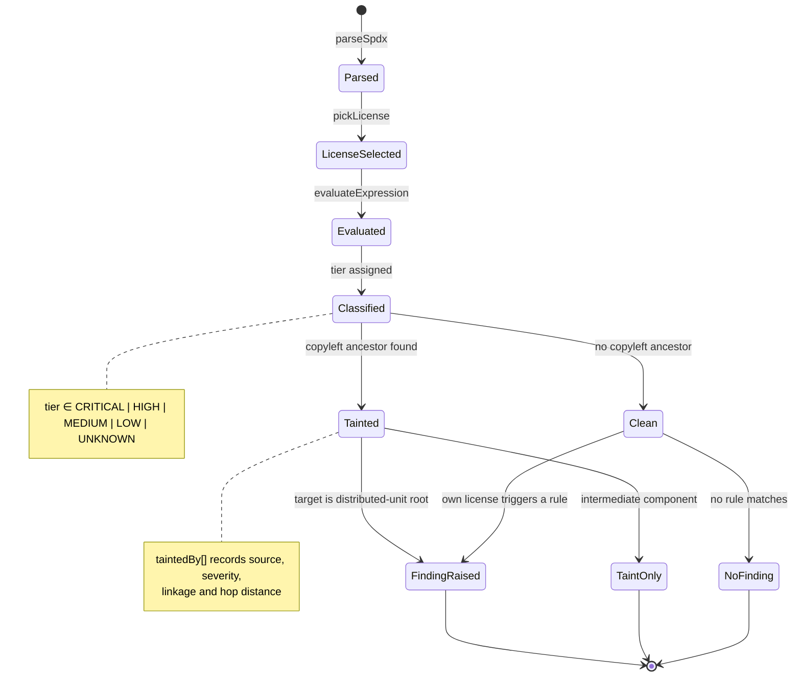
```mermaid
stateDiagram-v2
    [*] --> Parsed: parseSpdx
    Parsed --> LicenseSelected: pickLicense
    LicenseSelected --> Evaluated: evaluateExpression

    Evaluated --> Classified: tier assigned
    Classified --> Tainted: copyleft ancestor found
    Classified --> Clean: no copyleft ancestor

    Tainted --> FindingRaised: target is distributed-unit root
    Tainted --> TaintOnly: intermediate component
    Clean --> FindingRaised: own license triggers a rule
    Clean --> NoFinding: no rule matches

    FindingRaised --> [*]
    TaintOnly --> [*]
    NoFinding --> [*]

    note right of Classified
        tier ∈ CRITICAL | HIGH | MEDIUM | LOW | UNKNOWN
    end note
    note right of Tainted
        taintedBy[] records source, severity,
        linkage and hop distance
    end note
```

**Analysis.** This is the lifecycle of a single component through `analyze()`. The states are
not stored as a field — there is no `state` property — but the progression is real and strictly
ordered, which matters for two reasons.

**Ordering guarantees a component is never partially classified.** `pickLicense` always
produces an effective license (falling back to `NOASSERTION`), so `evaluateExpression` always
has input and `tier` is always assigned. There is no "unclassified" resting state, which
removes an entire class of null-handling bugs.

**The `Tainted` → `FindingRaised` / `TaintOnly` split is the fix for BUG-06.** Both transitions
record the taint; only the root transition produces a finding. A component can therefore be
"affected" without being "reported", which is the correct relationship: an intermediate library
is not itself an action item, but a reviewer drilling into it should see that it carries
copyleft.

---

### B-12 — UI application lifecycle (state machine)

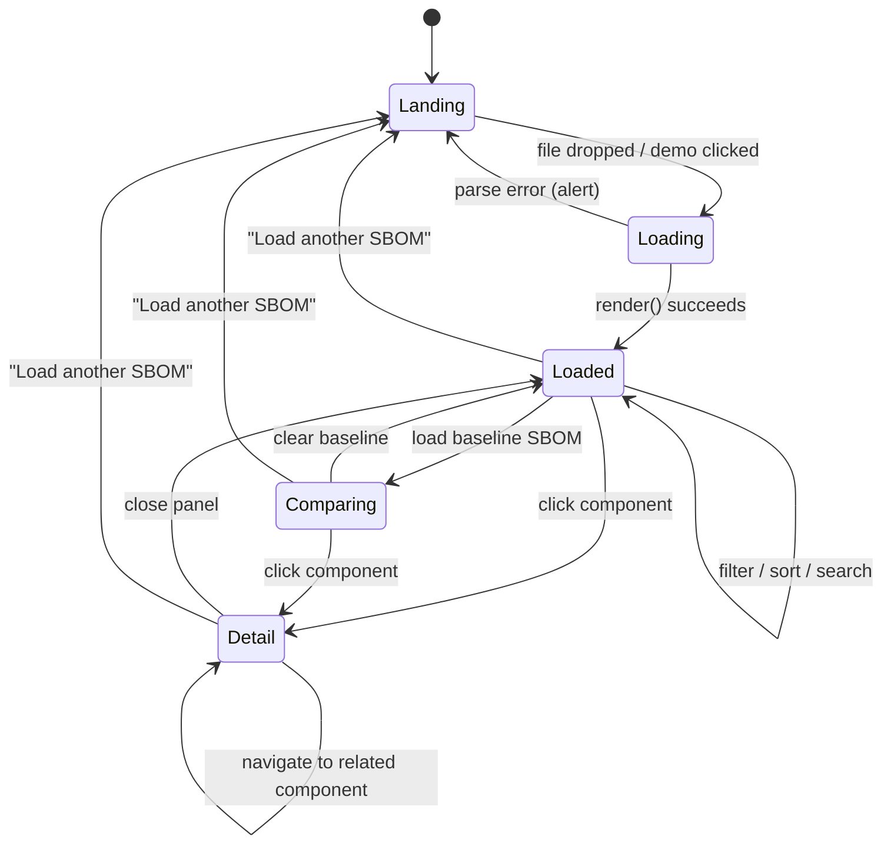
```mermaid
stateDiagram-v2
    [*] --> Landing
    Landing --> Loading: file dropped / demo clicked
    Loading --> Landing: parse error (alert)
    Loading --> Loaded: render() succeeds

    Loaded --> Loaded: filter / sort / search
    Loaded --> Detail: click component
    Detail --> Detail: navigate to related component
    Detail --> Loaded: close panel

    Loaded --> Comparing: load baseline SBOM
    Comparing --> Loaded: clear baseline
    Comparing --> Detail: click component

    Loaded --> Landing: "Load another SBOM"
    Comparing --> Landing: "Load another SBOM"
    Detail --> Landing: "Load another SBOM"
```

**Analysis.** The state is genuinely simple — one analysis result at a time, plus an optional
baseline — and the diagram deliberately shows that. There is no router, no history stack, and
no server session, which is why the whole UI fits in one 397-line module without a framework.

Two transitions deserve attention:

- **`Loaded → Loaded` on filter.** Filtering re-renders views but never re-runs `analyze`. The
  verdict is computed once and is immutable for the session. This is what makes filtering instant
  and guarantees the user cannot accidentally change a result by interacting with the UI.
- **`Comparing` is orthogonal to `Detail`.** A baseline can be loaded and the detail panel still
  works, because the baseline only adds a derived view (the diff card); it does not change the
  current analysis. Modelling this as a separate state rather than a mode flag keeps the two
  concerns from entangling.

---

### B-13 — Graph simulation lifecycle (state machine)

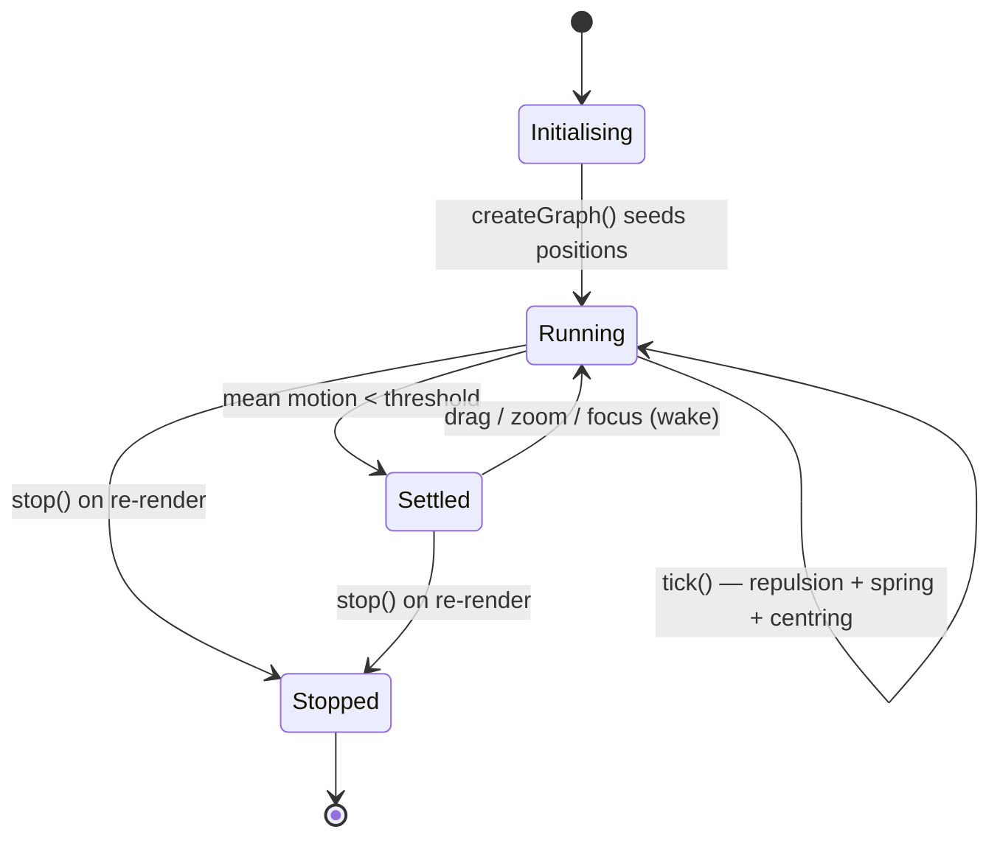
```mermaid
stateDiagram-v2
    [*] --> Initialising
    Initialising --> Running: createGraph() seeds positions
    Running --> Running: tick() — repulsion + spring + centring
    Running --> Settled: mean motion < threshold
    Settled --> Running: drag / zoom / focus (wake)
    Running --> Stopped: stop() on re-render
    Settled --> Stopped: stop() on re-render
    Stopped --> [*]
```

**Analysis.** This state machine exists because of BUG-12. The first implementation started a
`requestAnimationFrame` loop and never stopped it, so an idle dashboard consumed CPU
indefinitely — unacceptable for a tool left open on a workstation all day.

**`Settled` is the important state.** The loop compares mean node motion against a threshold
each tick and cancels itself when the layout stops changing. Any user interaction calls `wake()`,
which raises the simulation temperature and restarts the loop. The visual effect is identical
to a permanently running simulation; the cost is not.

**`Stopped` is reached on every re-render.** When a filter changes, `app.js` calls `stop()`
before creating a new graph, so discarded simulations cannot keep animating against a detached
DOM. Forgetting this would leak a rAF loop per filter change.

The layout itself is O(n²) per tick, which is fine to roughly 1 000 nodes and is why nodes
above 600 are down-sampled before rendering (TD-04).

---

## 8. Deployment architecture

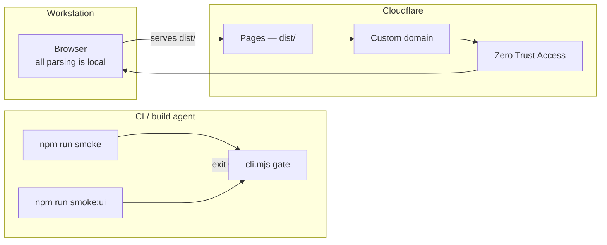
```mermaid
flowchart LR
    subgraph ws["Workstation"]
        B["Browser<br/>all parsing is local"]
    end
    subgraph ci["CI / build agent"]
        T["npm run smoke"]
        TU["npm run smoke:ui"]
        G["cli.mjs gate"]
    end
    subgraph cf["Cloudflare"]
        P["Pages — dist/"]
        D["Custom domain"]
        A["Zero Trust Access"]
    end

    B -->|"serves dist/"| P
    T --> G
    TU --> G
    G -->|"exit 0 / 1"| ci
    P --> D
    D --> A
    A --> B
```

| Environment | Form | Notes |
|---|---|---|
| Workstation | `python -m http.server` (or any static server) | Must be HTTP; ES modules are blocked on `file://` |
| CI | `node tools/cli.mjs gate …` | Non-zero exit blocks the pipeline |
| Corporate web | Cloudflare Pages serving `dist/` | Custom domain + Zero Trust Access; also protect `*.pages.dev` |
| Agent | `node tools/mcp-server.mjs` | Launched by the MCP client; local process |

`_headers` sets `X-Content-Type-Options`, `Referrer-Policy`, `X-Frame-Options`, and
`Cache-Control: no-cache` for HTML/JS — because with no content hashing, aggressive caching
would serve stale code after a redeploy.

---

## 9. Cross-cutting concerns

| Concern | Approach |
|---|---|
| **Confidentiality** | No network calls anywhere; verified by static scan |
| **Determinism** | No `Date.now()`, no randomness, no I/O in the verdict path |
| **Error handling** | Parse failures surface a targeted message; UI shows an alert, CLI exits 2, MCP returns `isError` |
| **Performance** | O(n²) layout acceptable to ~1 000 nodes; 600-node render cap; graph loop settles |
| **Security (deployed)** | No user input reaches an interpreter; `innerHTML` output is escaped via `esc()`; static hosting has no attack surface |
| **Maintainability** | Rule tables are declarative; adding a license is one line |
| **Internationalisation** | English only; license identifiers are language-neutral |

---

## 10. Architecture decision records

| ID | Decision | Status |
|---|---|---|
| ADR-001 | Pure-function engine shared by UI, CLI and MCP | Accepted |
| ADR-002 | Zero runtime dependencies | Accepted |
| ADR-003 | Findings as the primary output, score secondary | Accepted |
| ADR-004 | Density-normalised scoring | Accepted (supersedes count-based, BUG-08) |
| ADR-005 | Conservative static-link default for `DEPENDS_ON` | Accepted |
| ADR-006 | Explicit linking-exception modelling | Accepted |
| ADR-007 | `OR` = best case plus election note | Accepted |
| ADR-008 | Findings deduplicated per distributed unit | Accepted (supersedes per-hop, BUG-06) |
| ADR-009 | `LicenseRef-` with extracted text is resolved for copyleft purposes | Accepted (BUG-05) |
| ADR-010 | Identity = purl minus version, else name | Accepted |
| ADR-011 | Hand-written force layout instead of a graph library | Accepted |
| ADR-012 | MCP over stdio without the official SDK | Accepted |
| ADR-013 | Deploy a clean `dist/`, excluding `tools/` | Accepted |
| ADR-014 | LLM excluded from the verdict path | Accepted |
| ADR-015 | Diff operates on analysis results, not raw SBOMs | Accepted |
| ADR-016 | Gate exit code is the CI contract | Accepted |

---

## 11. Extension points

| Extension | Where | Effort |
|---|---|---|
| New license / exception / conflict | `LICENSE_RULES`, `LINKING_EXCEPTIONS`, `COMPAT` in `license-db.js` | Minutes |
| New finding rule | `risk-engine.js`, next free `LIC-0xx` (LIC-002 is reserved) | Hours |
| CycloneDX input | New parser producing the same normalised model as `parseSpdx` | Days |
| Enrichment (OSV, ClearlyDefined, deps.dev) | Post-parse step keyed on purl; must remain optional and offline-capable | Days |
| New export format | New renderer in `report.js` | Hours |
| Hosted API | Worker with a `fetch` handler wrapping `risk-engine.js` (the stdio MCP server cannot run on Workers — no stdin/fs) | Days |
| Persistence and workflow | Backend service; engine unchanged | Weeks |

---

## 12. Technical debt and known limitations

| ID | Item | Impact | Planned |
|---|---|---|---|
| TD-01 | No persistence — every session re-analyses from scratch | Cannot diff without keeping files manually | Phase 2 (P2-01) |
| TD-02 | No waiver/approval workflow | Waivers tracked outside the tool | Phase 2 (P2-02) |
| TD-03 | Compatibility conflicts lack a process-boundary map | Over-reports conflicts | Phase 2 (P2-06) |
| TD-04 | O(n²) graph layout | Slow beyond ~1 000 nodes | Acceptable; add Barnes-Hut if needed |
| TD-05 | UI state is module-global in `app.js` | Harder to unit-test view logic | Acceptable at current size |
| TD-06 | Tier table not legally ratified | Verdicts are engineering triage | Phase 2 (M-8) |
| TD-07 | `app.js` mixes rendering and state | Some duplication between tables | Refactor if UI grows |
| TD-08 | No i18n | English only | If non-English users join |
| TD-09 | Expression parser does not validate against the SPDX license list | A typo'd identifier classifies as UNKNOWN rather than erroring | Add list validation |
| TD-10 | Scoring weights are judgement, not calibration | Score is a trend indicator only | Fit against historical data if available |

---

*End of document.*
